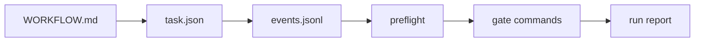

# Agent Symphony Kit

Local-first task orchestration and verification contracts for coding agents.

`agent-symphony-kit` gives Codex, Claude Code, Cursor, Gemini CLI, and other coding agents a small, inspectable control surface: `WORKFLOW.md`, task JSON files, JSONL events, preflight checks, and gate reports. It helps you manage work instead of juggling terminal sessions.

It is an unofficial toolkit for implementing local Symphony-style agent workflows and is not affiliated with OpenAI. It is inspired by the issue-centered workflow shape of OpenAI Symphony, but it is not a full Symphony implementation. It intentionally starts smaller: file-based, local-first, zero runtime dependencies, and safe to try in any repository.

## Quick Start

```bash
npx agent-symphony-kit init
npx agent-symphony-kit task create --title "Add checkout smoke test" --repo web --priority P1
npx agent-symphony-kit task list
npx agent-symphony-kit preflight
npx agent-symphony-kit gate --check "npm test" --check "npm run lint"
```

Short aliases after install:

```bash
npx agent-symphony-kit@latest --help
npm exec --package agent-symphony-kit agent-symphony -- init
npm exec --package agent-symphony-kit askit -- init
```

## Terminal Preview

```text
$ askit task list
id                         state  priority  repo  age_min  stale  title
-------------------------  -----  --------  ----  -------  -----  -----------------------
20260429120000-smoke-test  Ready  P1        web   0.2      no     Add checkout smoke test

$ askit preflight
check        status  detail
-----------  ------  -----------------------------
WORKFLOW.md  OK      ./WORKFLOW.md
task root    OK      ./.agent-symphony/tasks
node >=20    OK      22.22.2

Summary: OK=7 WARN=0 FAIL=0
```

## Why

Interactive coding agents are powerful, but managing several long-running sessions becomes messy. This kit adds the missing local operating layer:

- a versioned workflow contract in `WORKFLOW.md`
- durable task state under `.agent-symphony/tasks`
- append-only task events in `events.jsonl`
- preflight checks for agent readiness
- gate reports for build/test/lint/typecheck or custom commands
- clear boundaries around publishing, deletion, credentials, and public actions

## What It Writes

```text
your-repo/
├─ WORKFLOW.md
└─ .agent-symphony/
   ├─ tasks/<task-id>/
   │  ├─ task.json
   │  ├─ task.md
   │  └─ events.jsonl
   └─ runs/
      ├─ <run-id>.json
      └─ <run-id>.md
```

In v0.1, gate output is Markdown and JSON. It does not write `report.html`; if you need `report.md`, `report.json`, or `report.html` naming for CI conventions, use a wrapper or copy the generated run files.

## Flow



## Commands

```bash
askit init [--path .] [--force]
askit task create --title "Fix bug" [--description "..."] [--repo name] [--priority P1] [--json]
askit task list [--state Ready] [--stale-minutes 20] [--json]
askit task show --id <prefix> [--json]
askit task log --id <prefix> [--json]
askit task set --id <prefix> --state Verify [--note "..."] [--verification "..."] [--artifact "..."]
askit preflight [--path .] [--json]
askit gate [--path .] [--check "npm test"] [--check "npm run lint"] [--dry-run] [--json]
askit run [--path .] -- <command>
askit report [--path .] [--json]
```

## Data Contract

Tasks are stored at:

```text
.agent-symphony/tasks/<task-id>/
├─ task.json
├─ task.md
└─ events.jsonl
```

Task states:

```text
Backlog -> Ready -> Running -> Blocked -> Review -> Verify -> Done/Abandoned
```

Each event is one JSON object per line. Timestamps use ISO 8601.

## Gate Reports

`askit gate` runs checks and writes reports under `.agent-symphony/runs`.

If you do not pass `--check`, it detects common package scripts from `package.json` in this order:

```text
lint -> typecheck -> test -> build
```

External scanners such as `agent-reliability-kit` and `agent-secret-guard` are optional. Use them as gate commands when installed:

```bash
askit gate --check "npx agent-reliability-kit scan . --min-score 80" --check "npx agent-secret-guard scan . --fail-on high"
```

## Safety Model

The CLI does not publish packages, create remote repositories, send messages, change DNS, spend money, or persist credentials.

It also does not modify global Codex, MCP, shell, browser, or credential configuration. Public actions should remain explicit human decisions.

## Development

```bash
npm install
npm run check
npm run pack:dry
```

See [CONTRIBUTING.md](CONTRIBUTING.md) for setup, pull request expectations, and release checks. Good first issues are docs examples, fixture coverage, and cross-platform path cases.

## Package Contract

- Node.js: `>=20`
- Runtime dependencies: none
- Binaries: `agent-symphony-kit`, `agent-symphony`, `askit`
- Preferred human-facing binary after install: `agent-symphony`
- Published files: `src`, `docs`, `examples`, `scripts`, and top-level project docs

## Roadmap

- GitHub Issues / Linear import and export adapters
- daemon mode with bounded concurrency
- richer workflow schema validation
- TUI status view
- optional integrations for Codex, Claude Code, and agent trace tools

## License

MIT
